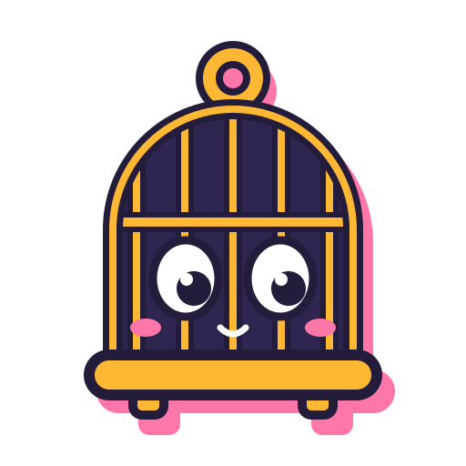
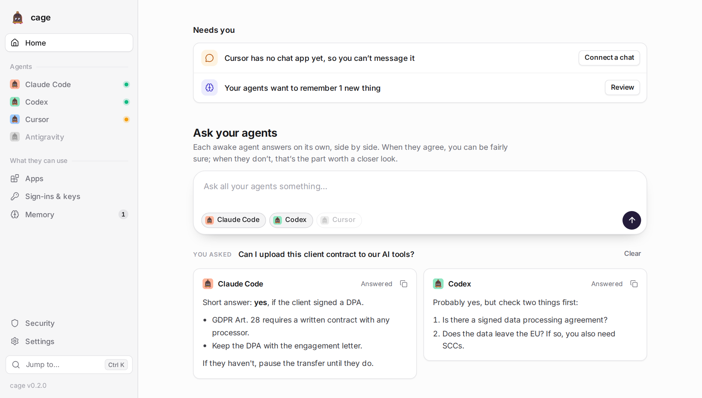
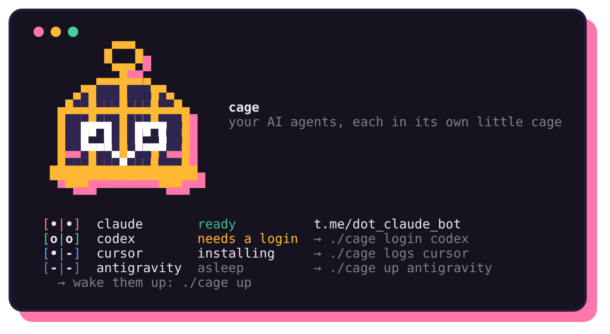
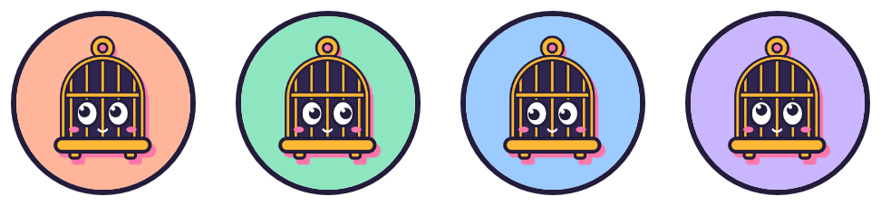
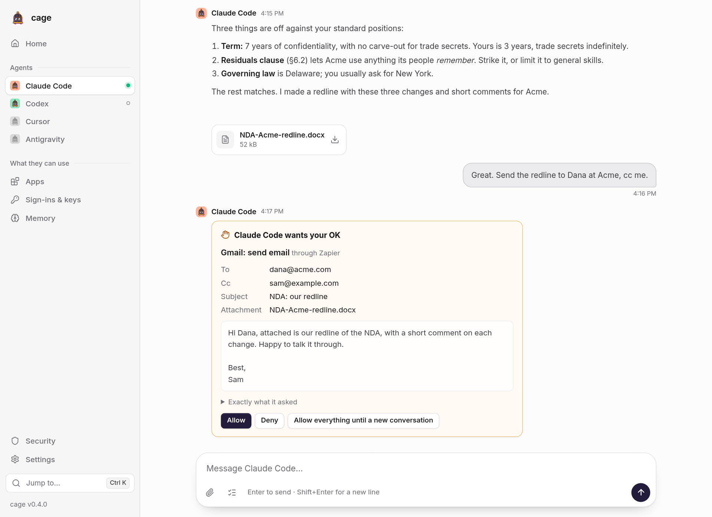

<p align="center"></p>

<h1 align="center">cage</h1>

<p align="center"><b>Your AI agents, each in its own little cage.</b><br>
Claude Code, Codex, Cursor and Antigravity on your own subscriptions.<br>
Each one lives in a private microVM. You chat with it in cage's app, or on Telegram, Slack, Discord or WhatsApp.</p>

<p align="center"><picture><source media="(prefers-color-scheme: dark)" srcset="assets/app-dark.png"></picture></p>

## Get started

**Windows 11:** download [Install-cage.cmd](https://github.com/z-brenner/cage/releases/latest/download/Install-cage.cmd) and double-click it, or open PowerShell and paste

```powershell
irm https://github.com/z-brenner/cage/releases/latest/download/install.ps1 | iex
```

**Linux:** open a terminal and paste

```bash
curl -fsSL https://github.com/z-brenner/cage/releases/latest/download/install.sh | bash
```

That's the whole setup. On Windows, or on Linux with a desktop, cage then opens in your browser and walks you through everything in about five minutes. No terminal needed:

1. **This computer:** it checks what your agents need and explains anything in the way in plain words. It fixes what it can. On a work computer it writes a note for your IT department about the rest. On Windows, the installer turns on WSL 2 first (restarting once if needed).
2. **Your agents:** pick the ones you have a plan for. Each gets its own private computer.
3. **Sign in:** a button opens each one's sign-in page, and you paste back a code if it asks. No terminal.
4. **About you** (optional): a few lines every agent reads.
5. **Chat:** that's it. Leave **Start my agents when I log in** ticked, and they wake up whenever you log in.

After that, open **Cage** from your Start menu (Windows) or app menu (Linux) to chat with your agents and see how they're doing. Telegram, Slack, Discord and WhatsApp are there for your phone, whenever you want them.

The app does everything, in plain words:
- **Home** shows what needs you (an agent waiting for your OK, a sign-in, something cage blocked), what each agent is doing, and how much of its plan is left.
- **Ask your agents** sends one question to every awake agent and shows their answers side by side, so you can see where they agree.
- **Each agent's page** is a chat with it, its files, and its settings: chat apps, asking before it acts (for Codex, working read-only), plan usage, privacy mask, and who answers when it hits its usage limit.
- **Apps, Sign-ins & keys, Memory, Security and Settings** cover the rest. Press Ctrl+K (⌘K on a Mac) to jump to any of them.

Each action runs cage itself and shows its questions in a side panel, as a conversation. Vendor sign-ins open in a terminal view inside that panel. The app only listens on your own computer and needs the private link it opened with. It works on a phone-sized window too, and follows your system's light or dark mode.

Prefer a terminal? Type `cage` instead. Its guided setup asks first where you want to chat: in cage's app (recommended), or in Telegram with a bot for each agent. Every command below works there too (`cage ui` opens the app). On a server without a desktop, the setup runs in the terminal, and you open the app from your own computer over SSH (see [Troubleshooting](#troubleshooting)).

<p align="center"></p>

<p align="center"></p>

## What you need

- **Windows 11** on an x64 PC, or **Linux** on x86_64 or arm64. On Linux, microsandbox needs glibc 2.28 or newer: Ubuntu, Debian, Fedora and most others from 2019 on, but not Alpine.
- **Virtualization turned on**, because each agent runs in a small virtual machine of its own. On most PCs it's on already. If cage itself runs in a virtual machine (VirtualBox, VMware, a cloud server), that one has to allow nested virtualization (see [Troubleshooting](#troubleshooting)).
- **About 15 GB of free disk space.** Each agent needs about 5 GB, more as it works.
- **8 GB of memory or more.** Each awake agent uses up to 4 GB. With less, keep one or two awake at a time.
- **A plan for each agent you want:** Claude Pro or Max, a ChatGPT plan (Codex), a Cursor account, Google AI Pro or Ultra (Antigravity).

## Reading the faces

Every agent is a little creature in a cage, and its eyes tell you how it is.

| | |
|---|---|
| `[•\|•]` | awake and ready |
| `[o\|o]` | needs you to sign in: `cage login <agent>` |
| `[•\|-]` | busy (it blinks while it installs) |
| `[-\|-]` | asleep: `cage up` |
| `[x\|x]` | stopped while starting: `cage logs <agent>` says why |
| `[ \| ]` | no cage yet |

## Everyday commands

```text
cage                  set up, or see how your agents are doing
cage ui               the same, and everything else, in your browser
cage up [agents]      wake agents up (a fresh VM; logins and files are kept)
cage down [agents]    put them to sleep
cage restart [agents] start them afresh, with the same logins and files
cage status [--json]  how each one is doing (--json: for scripts)
cage login <agent>    sign an agent in to your subscription
cage add <agents>     more agents, to chat with in the app (no bot needed)
cage remove <agent>   no longer one of your agents (--keep-login keeps its login and files)
cage approve <a> on   it asks you before it acts in your apps (Codex can't: it works read-only)
cage logs <agent>     what an agent's VM printed lately (--tail 500: more of it; -f: follow along)
cage memory           review what your agents want to remember
cage connect          let your agents use Gmail, Calendar, GitHub, Linear…
cage password add …   a website sign-in they can use but never see
cage chat add slack   talk to an agent in Slack too (or discord, whatsapp)
cage secret add …     give agents a key they can use but never see
cage backup           everything in one encrypted file (cage restore puts it back)
cage security         what was blocked: keys sent to the wrong place, hosts (strict network)
cage ask "…"          every awake agent answers (cage ask-all on: /all in chat too)
cage fallback a b     when agent a is out of quota, b answers in its chat
cage voice on         voice notes, turned into text on each agent's own VM
cage mask on          emails, numbers and keys reach the AI vendor as placeholders
cage network strict   each agent reaches only what it needs (cage allow <host> for more)
cage doctor           check this computer, the config and the bots
cage autostart on     wake them up whenever you log in
cage update           the newest cage, then your agents with fresh downloads (cage rollback: back again)
cage uninstall        take cage off this computer (your backups stay)
cage help             everything else
```

In Telegram, each chat is a session: `/new` starts fresh, `/stop` interrupts, `/list` and `/switch` move between sessions, `/model` and `/mode` change how the agent works, `/usage` shows your quota.

**Ask all your agents:** turn it on once with `cage ask-all on`. Then, in any agent's chat (Telegram, Slack, Discord or WhatsApp), start a message with `/all` or `@all` (in Slack, `@all`: Slack keeps `/` for its own commands). That agent answers as usual, and your other awake agents' answers arrive in the same chat. From the terminal, `cage ask "…"` asks all of them at once.

You can also add the bots to one Telegram group, turn **Group Privacy** off for each (BotFather → Bot Settings), and @mention the bots you want. Set `CAGE_TELEGRAM_GROUP_REPLY_ALL=true` to have all of them answer everything there.

**When one runs out of quota:** with `cage fallback claude codex`, a usage-limit reply from Claude is followed by Codex's answer to your message, in the same chat. Codex sees the last few messages. It works for any pair, and `cage fallback claude off` turns it off.

Answers from `/all` and stand-ins are read-only and don't use your connected apps. With the [privacy mask](#privacy-mask) on for the agent you asked, what you told it stays masked when it's passed on. Both features are off until you turn them on, because they let one agent's VM put questions to another (see the security model).

**Voice notes:** run `cage voice on` and send voice messages on Telegram, Slack, Discord or WhatsApp.
- Each agent's VM turns them into text itself with Whisper, so nothing you say leaves your computer. The first time, it downloads about 300 MB.
- `CAGE_VOICE_MODEL=small` in `~/.cage/cage.env` is more accurate but slower. `CAGE_VOICE_LANGUAGE=en` skips language detection.
- `cage voice on groq` uses Groq's Whisper API instead: faster, with your key, which the VMs never see.

## Chat in the app

Every agent has a chat in cage's app, on its page: no bot or phone needed.

<p align="center"><picture><source media="(prefers-color-scheme: dark)" srcset="assets/chat-dark.png"></picture></p>

- **Files go both ways.** Attach files with the paperclip, drop them on the chat, or paste a picture. Files the agent makes for you show up in the chat, and the **Files** tab lists them, along with the agent's own work folder: download anything from it, or upload files for it to use.
- **Answers stream in** as the agent writes them, and **starters** on an empty chat show what to ask. **Stop** (or Esc, when you haven't typed anything) stops it while it works. Each answer has **Copy** (it pastes into Word or an email with its formatting) and **Save as a file**.
- **Asking first:** with **Ask before acting in your apps** on (`cage approve claude on`), Claude Code asks before it sends an email, books a meeting or changes anything in an app you connected, with Allow and Deny buttons; work on its own computer goes ahead. Cursor and Antigravity can only ask before every action. Codex can't ask at all: its switch is **Work read-only** (`cage approve codex on`), and with it on, Codex can read and answer, but not change files. Apps you connected for it may still let it act, so to be sure, don't connect apps to Codex. The question says in words what it would do ("Gmail: send email", to whom, the subject, the email), and exactly what it asked is one click away. Its third button, **Allow everything until a new conversation**, stops all asking in that chat: the agent then does anything, in any app, without asking you, and so do scheduled tasks that run in that chat, until you start a **New conversation**. While an agent waits for your OK, **Home** says so first, in the same words, with Allow, Deny and Open (just Open and Deny when the request is too long to show there in full).
- **Plan usage:** Home shows how much of each plan is left (Claude Code and Codex report it), and offers a stand-in for an agent that has used it up. Home asks each agent at most every 10 minutes (**Check again** in its settings asks sooner).
- **An asleep agent wakes up** when you message it; your message waits for it.
- **New conversation** (the pencil, or `/new`) starts fresh. cc-connect's other commands work too: `/stop`, `/model`, `/usage`.
- **Scheduled tasks:** the **Schedule** tab lists what the agent does on its own (“every weekday at 8:00 AM, summarize my inbox”), with **Run now** and **Delete**, and adds new ones in plain words. Asking in the chat works too. They run in your time zone, while the agent is awake (so turn on **Start at login**), and what they say lands in the chat.
- **Recipes:** ready-made tasks to start from, on the Schedule tab and in an empty chat: a morning briefing, inbox triage, prep for tomorrow's meetings, a Friday status draft, a first pass on a contract or NDA, a news watch, follow-ups you owe, and receipts into a spreadsheet. Each says which apps it uses (most need Gmail or Calendar through Zapier) and what to fill in. One that reads your email on a schedule runs with nobody watching, and anyone can send you an email, so turn on **Ask before acting** for that agent first (the Schedule tab reminds you when you add one; Codex can't ask, so give those to another agent).
- **Keyboard:** Ctrl+K (⌘K) goes to any page or does anything, Alt+1 to 4 opens an agent's chat (on a Mac, ⌥1 to ⌥4 when you're not typing), Ctrl+Shift+O starts a new conversation, and ? lists them all.
- **Notifications:** turn on **Desktop notifications** in Settings to hear about replies, files and requests for your OK while you're looking elsewhere; the sidebar marks agents with unread messages either way.
- **An app of its own:** in Chrome or Edge, **Install as an app** (in the sidebar, or the install icon in the address bar) gives it its own window and taskbar icon. It still runs only on your computer: nothing is sent anywhere, and all it keeps is a small page that says what to do when cage isn't running.

**Ask all your agents in the app:** the question box on Home asks every awake agent at once and shows their answers side by side. **Where do they disagree?** has one agent compare the answers (where they agree, where they don't, what to double-check). A follow-up goes to all of them with the answers so far, so they can build on or push back on each other. Earlier questions are kept in this browser only.

How it works: the app and each agent's VM share a folder, `~/.cage/app/<agent>`. A small relay in the VM ([guest/app.mjs](guest/app.mjs)) passes your messages to cc-connect through its [bridge](https://github.com/chenhg5/cc-connect/blob/main/docs/bridge-protocol.md), and writes the replies to a log the app reads. So the chat is still there when you reopen the app, including what scheduled tasks said meanwhile.

## Slack, Discord and WhatsApp

You can also talk to an agent from your phone: Telegram, Slack, Discord or WhatsApp. Each one is that agent's own bot there, run by the same VM, with the same login and files.

```bash
cage chat add slack claude      # opens a Slack app for claude, already filled in; you paste two tokens
cage chat add discord codex     # you make an app in Discord's portal and paste its token; cage does the rest
cage chat add whatsapp claude   # scan a QR code with WhatsApp, like WhatsApp Web
cage chat                       # who's where
cage chat rm telegram claude    # take a chat app away again (or slack, discord, whatsapp)
```

- **Slack:** the link creates the app with everything set (Socket Mode, so nothing on your computer is exposed to the internet). You click Install, then copy two tokens. DM it, or invite it to a channel and @mention it.
- **Discord:** cage turns on the permission it needs to read your messages, gives it its face, and shows an invite link (and a QR code) for your server. DM it, or @mention it in a channel.
- **Only you can talk to it** unless you say otherwise: cage finds your Slack account from your email, and your Discord account from the app's owner.
- **Letting coworkers use it** is possible (`everyone`, or a list of emails in Slack), but think twice. Each agent runs on *your* personal subscription. Those plans are for one person, so sharing one with a team likely breaks their terms (see below). Everyone you let in can also reach what you connected it to: your email, files and keys. For a team bot, use the vendor's team plan or API key instead.
- **WhatsApp:** your agent links as a device of a WhatsApp number, through [Baileys](https://github.com/WhiskeySockets/Baileys) (an open-source, unofficial WhatsApp Web client) plugged into cc-connect's bridge. WhatsApp doesn't allow unofficial clients and has banned numbers for it, so **use a spare number** if you can (a prepaid SIM, or a second number in the WhatsApp Business app), then message it from your own phone. Linking your own number works too: the agent then answers only in your "Message yourself" chat, but its VM holds a key to your whole WhatsApp. If the link drops: `cage chat link whatsapp <agent>`. Messages you send while the agent is asleep reach it when it wakes up, if they're less than a day old.

## Privacy mask

```bash
cage mask on [agents]          # on for all agents, or the ones you name
cage mask add "Acme Corp"      # your own sensitive terms: clients, projects, people
cage mask try "mail bob@acme.com about Acme Corp"   # see what the AI company would get
cage mask forget               # each awake agent drops the real values behind its placeholders
cage mask off
```

With the mask on, sensitive values become placeholders like `[EMAIL_1]` before they reach the AI company, and turn back into the real values in the replies you read. The same value always gets the same placeholder, so the agent can still tell them apart. The mask runs inside each agent's VM, between cc-connect and the agent's CLI, so it works the same in the app, Telegram, Slack, Discord and WhatsApp.

**What it masks:**
- what you type, and your answers to the agent's questions;
- your About me, and your notes' names and titles (if the mask can't run, they're left out, never sent as they are);
- what `/all`, a stand-in or `cage ask` passes on from a masked agent;
- in all of these: email addresses, phone numbers, card numbers (Luhn-checked), IBANs (checksum-checked), US social security numbers, API keys, tokens, passwords and private keys, and your own terms.

More kinds are off by default, because they touch more everyday text: public IP addresses, MAC addresses, crypto wallets, dates of birth, passport numbers, national ID numbers, bank account numbers and street addresses. To pick the kinds, list all you want in `~/.cage/cage.env`, the usual ones too, then `cage up`:

```bash
CAGE_MASK_TYPES="email,phone,card,iban,ssn,secret,term,ip,address"
```

**What it doesn't cover:**
- Files and pictures you send, notes and web pages the agent opens, and what your connected apps return reach the AI company as they are.
- Voice notes go to Groq as they are, if you use Groq for them (`cage voice on groq`).
- Anyone who can chat with the agent can ask it about masked values, and so can a web page or an app result it reads: its replies show the real values.
- The real values are kept in the agent's VM, so something that tells the agent to look there can find them. Each VM forgets a value after 90 days unused, or right away with `cage mask forget`. Then start new conversations (`/new`): older ones still mention placeholders that now mean nothing.

The trade-off is that the agent can't use a masked value itself: it only sees `[EMAIL_1]`. It knows this, and asks when a task needs one.

## Memory

Your agents share one memory, and it's yours: a folder of plain notes on your computer (`cage memory open`; it works as an Obsidian vault too).

- **`about-me.md`** is read by every agent before every conversation. Setup asks three quick questions to start it.
- **Agents suggest; you decide.** When an agent learns something worth keeping, it drops a note in its own inbox. `cage memory` shows you each one: keep it and every agent knows it, or forget it. The home screen tells you when there's something to review.
- **Why the extra step:** a note one agent writes can't quietly become instructions for the others. Agents can read your approved notes but never change them, and they can't see each other's inboxes.

## Connect your apps

```bash
cage connect                                   # what you can connect, and what's connected
cage connect add zapier                        # Gmail, Calendar, Drive, Slack, Notion and thousands more
cage connect add github                        # repositories, issues and pull requests
cage connect add linear                        # issues and projects
cage connect add notion                        # Notion: you sign in in the browser
cage connect add crm https://example.com/mcp   # any other app with an MCP address
```

Each one shows you where to get a key, then wires the app into every agent's own CLI as an MCP server. The key is kept like the ones [below](#keys-your-agents-can-use-but-never-see): it stays on your computer, and only that app's own servers ever see it.

- **Zapier is the shortcut.** You sign in to Gmail, Google Calendar, Slack and the rest on Zapier's site and choose what your agents may do there; one key covers all of it.
- **Claude** also gets the connectors on your claude.ai account (Settings → Connectors), because it signs in with that account.
- **Apps you sign in to in the browser:** `cage connect add notion` (or `atlassian` for Jira and Confluence, `sentry`, or any MCP address that asks for a sign-in). Your browser opens on the app's own sign-in page. The sign-in stays on your computer, in `~/.cage/oauth`. Its short-lived access token becomes a secret like the keys below, so the VMs hold only a placeholder for it. While your agents are awake, cage renews the token before it expires and swaps the new one in without a restart. This needs `python3`, which Ubuntu has.
- Adding or removing an app restarts the agents that are awake, which takes a minute or two.

## Keys your agents can use but never see

```bash
cage secret add GITHUB_TOKEN api.github.com          # asks for the value; it stays on your computer
cage secret add LINEAR_KEY api.linear.app claude      # only for claude
cage secret list
```

The agent gets a stand-in for the key. When it calls `api.github.com` with it, microsandbox swaps in the real key on its way out of the VM; sent anywhere else, it's blocked. So even a tricked agent can't leak the key itself, though it can still use it at that host, so prefer narrow, read-only tokens. It covers keys sent in request headers, which is how most APIs work (not Telegram tokens or website passwords). To do the swap, microsandbox inspects that VM's HTTPS on your computer, except for the agent's own service and Telegram. Agents without keys aren't inspected.

## Website passwords your agents can use but never see

```bash
cage password add example.com          # asks for the username and the password (hidden)
cage password add app.example.com codex
cage password                          # what's saved
cage password rm example.com
```

Your agents get a web browser (headless Chromium, through Microsoft's [Playwright MCP](https://github.com/microsoft/playwright-mcp)) and, for each site, a placeholder like `cagepw-example-com-x7k2…`. They type it into the site's own password field. When the sign-in form is sent to that site, microsandbox swaps in your real password; sent anywhere else, it's blocked. The password never enters the VM: the agent sees it only if the site itself shows it back (a page that repeats what was typed into a form). So use a password you use nowhere else. And the agent can use the account while it's signed in, so prefer accounts with limited rights.

- **Passwords with symbols** (`&`, `%`, `+`, spaces…) get a second placeholder holding the password already encoded for classic HTML forms. Agents are told to try that one if the site says the first one is wrong. Quotes and backslashes may not get through sign-ins that send JSON.
- **Some sign-ins can't work this way:** sites that encrypt or hash the password in the page before sending it, and big providers that block automated browsers (Google, Microsoft, Apple). For Gmail and friends use Zapier ([above](#connect-your-apps)) instead.
- The browser's profile lives in the agent's home, so it stays signed in across restarts. `cage connect add browser` gives an agent the browser without any passwords.

## Backups

```bash
cage backup            # everything, in one encrypted file
cage restore           # list your backups
cage restore <file>    # put one back: on this computer, or on a new one after installing cage
```

A backup holds your settings, bots, keys, app sign-ins and memory (`~/.cage`), plus each agent's home volume: its login, sessions and work. Caches it can download again are left out. It's encrypted with a passphrase you pick (AES-256, PBKDF2 with 600,000 rounds, via openssl), so it's fine to keep in cloud storage. Nobody can recover a forgotten passphrase.

- Backups go to `~/cage-backups`. On Windows they go to `Documents\cage backups` instead, so they survive even if the WSL distro is removed. Set `CAGE_BACKUP_DIR` to change this.
- The newest 10 are kept (`CAGE_BACKUP_KEEP`).
- Agents can keep running during a backup.
- Each backup is opened again right after it's written, to check it. `restore` checks the passphrase and the free space before it changes anything.
- On a Mac, backups need GNU tar: `brew install gnu-tar`.
- `restore` puts your agents to sleep, sets aside what's there now (in `~/.cage.before-restore-…`), then wakes them up with the restored logins and files.

## Updates and going back

```bash
cage update                 # the newest cage, then your agents rebuilt with fresh downloads
cage update --to v0.3.0     # a release you name, older ones too
cage rollback               # back to the release you had before, without a download
cage --version              # which one you have
```

- **`cage update`** (the **Update** button in the app) installs the newest cage release first. The download is checked against the release's `SHA256SUMS` before anything is replaced. If your microsandbox is older than the one cage is tested with, that's updated next. Then your agents are rebuilt with fresh downloads: their CLIs (Claude Code from its stable channel, about a week behind its newest), Ubuntu's packages, and the cc-connect version this cage is tested with. Logins, sessions and files are kept.
- **With no internet it changes nothing:** "you're offline (or a firewall is in the way); nothing was changed, your agents keep running".
- **It never moves you to an older release by itself**, and never swaps a release for an unreviewed copy of the code on git. If an update stops halfway, run `cage update` again to finish it.
- **Going back:** cage keeps the last two releases it installed (in `~/.cage/releases`). `cage rollback` puts the one before back, after checking it against its checksums again, then wakes your agents with it. For an older one, `cage update --to v0.3.0` downloads it.
- **Where a release comes from:** every file carries a signed build-provenance attestation. `gh attestation verify cage-v0.4.0.tar.gz --repo z-brenner/cage` shows it was built by this repo's release workflow from that tag.
- To follow the development version instead, install with `CAGE_REF=main`.

## Uninstall

**Linux:** `cage uninstall` takes cage off this computer: your agents' VMs, the background helpers, start at login, the `cage` command (and the lines the installer added to your shell's settings), and cage itself (`~/cage`). It offers a backup first. Your agents' logins and files and cage's settings (`~/.cage`) stay, so installing cage again brings your agents back, unless you type `delete` when it asks. `cage uninstall --everything` deletes those too (`--yes --everything` without asking).

**Windows:** in PowerShell, run the install line with `CAGE_UNINSTALL` set:

```powershell
$env:CAGE_UNINSTALL='1'; irm https://github.com/z-brenner/cage/releases/latest/download/install.ps1 | iex
```

You type `remove` to confirm, and it offers a backup first. Then it removes cage's Linux distro (your agents, their logins and files, cage's settings), the Start menu shortcut and start at login.

Either way, your backups always stay. So does microsandbox on Linux: it's a program of its own, and `cage uninstall` says how to remove it too.

## Windows

cage runs inside WSL 2 and behaves just as on Linux. It needs **Windows 11** on an x64 PC with virtualization turned on: WSL 2 only runs VMs inside it on Windows 11, and Windows on ARM can't.

The PowerShell line above does all of this for you: it gives cage its own Ubuntu called **cage** (separate from any Ubuntu you already have), creates your Linux user, and starts the setup. In that Ubuntu, your Linux user can use `sudo` without a password, so setup never stops to ask: anything you run there can become root there. Keep your other Linux work in a separate Ubuntu. To do it by hand instead: `wsl --install -d Ubuntu-24.04`, open Ubuntu, and run the Linux line. Keep cage in your Linux home (`~/cage`), not under `/mnt/c`.

- **Closing the window is fine.** WSL normally stops Ubuntu about 15 seconds after its last window closes, VMs included. `cage up` keeps one hidden WSL session open so your agents stay up; `cage down` lets it go.
- **Reboots:** `cage autostart on` wakes your agents at every Windows login (no admin needed; a window flashes for a few seconds).
- **Memory:** WSL gets half your RAM, and each agent takes 4 GB of that. With 16 GB or less, put `CAGE_MEMORY=2G` in `~/.cage/cage.env`.
- **No `/dev/kvm`?** Check that `nestedVirtualization` isn't `false` in `%UserProfile%\.wslconfig`, that `wsl -l -v` shows version 2, and that Task Manager → Performance → CPU says *Virtualization: Enabled*. Then `wsl --shutdown` and reopen Ubuntu. On a work PC, a company policy may turn nested virtualization off: the installer then writes a note for your IT department.

## Good to know

- **Sign-ins happen inside each VM**, with each vendor's own CLI, and stay on that agent's volume. They survive `up`, `update`, reboots and `cage destroy <agent> --keep-login`.
- **Codex:** turn on device-code sign-in first (ChatGPT → Settings → Security).
- **Antigravity** is Google's successor to Gemini CLI for AI Pro/Ultra (since 2026-06-18). Google has suspended accounts over third-party use of its CLI logins, so consider a spare Google account.
- **After a reboot** your agents sleep until you wake them (or turn on autostart, once). Each VM's system disk is new every time, but everything it downloaded (Ubuntu packages, Node.js, its CLI, cc-connect) is kept in a cache of its own. So waking reinstalls from there in seconds, without any vendor's servers, and logins, sessions and files are kept. `cage update` (the **Update** button) downloads everything afresh (see [Updates and going back](#updates-and-going-back)).
- **The browser** (`cage connect add browser`, or with a website password) gets ready in the background, about a minute after an agent wakes up. If the agent asks for it sooner, it's told to try again in a few minutes.
- **The app's chat folder** (`~/.cage/app/<agent>`) tidies itself: a file that no chat mentions anymore goes after a week, or sooner once the folder holds more than 2 GB.
- **Time zone:** each VM runs in your computer's time zone (from `TZ`, or the system's), so a task set for 8am runs at your 8am. After changing time zones, `cage up` the agents.
- **Settings** live in `~/.cage/cage.env` (CPU, memory, disk, network rules, `CAGE_MODE=ask` to approve each tool call in chat; Codex can't ask, see the [security model](#security-model)).
- **microsandbox:** cage installs the version it's tested with (0.7.5), with microsandbox's own installer and without a lookup on GitHub's API. If yours is too old, cage asks you to run `cage fix` before it wakes your agents.

## Troubleshooting

- **`cage update` says you're offline.** Nothing was changed, and your agents keep running. Check your connection, or your company's proxy or firewall, then try again. `cage doctor` names what it can't reach.
- **An update went wrong, or you'd rather not have it:** `cage rollback` goes back to the release you had before, without a download. `cage update --to v0.3.0` installs any release.
- **Chats misbehave since v0.4.0** (replies stop, or arrive twice): this release's cc-connect, which connects your chats to your agents, is a preview (1.5.1-beta.3). Put `CAGE_CC_CONNECT_VERSION=stable` in `~/.cage/cage.env` and run `cage update` to go back to its stable 1.5.0.
- **"No /dev/kvm" or "Virtualization is turned off":** turn on Intel VT-x or AMD-V in your computer's BIOS or UEFI settings, then restart. If `/dev/kvm` is there but you can't use it, `cage fix` adds you to the kvm group (then log out and back in). On Windows, see [Windows](#windows).
- **cage runs inside a virtual machine** (VirtualBox, VMware, Parallels, Hyper-V, a cloud server): that machine has to allow nested virtualization. `cage doctor` says where to turn it on for each. In the cloud, pick an instance type that offers it.
- **microsandbox won't install:** `cage fix` tries again, and everything its installer said is in `~/.cage/msb-install.log`. If an older microsandbox comes first on your PATH, remove it, or put `~/.local/bin` first.
- **An agent keeps blinking (installing):** the first time it wakes, it downloads its tools, which can take several minutes on a slow connection; later wakes take seconds. It keeps trying by itself, allowing more time on each try. `cage logs <agent>` shows what it's doing (`-f` to follow along), and `cage restart <agent>` starts it afresh.
- **Where the logs are:** `cage logs <agent>` shows what an agent's VM printed (or, if it printed nothing, what microsandbox noted about it). In `~/.cage`: `ui.log` (the web app), `refresh.log` (the background helper: `/all`, app sign-ins, security events), `autostart.log` (start at login) and `msb-install.log` (installing microsandbox).
- **On a server, over SSH:** the app only listens on that computer. Connect with `ssh -L 7771:127.0.0.1:7771 <the server>`, run `cage ui` there, and open the link it prints in your own browser (it works once, within a minute). If port 7771 is taken: `CAGE_UI_PORT=7772 cage ui`, and forward that one.
- **A company or nearby mirror for Ubuntu's packages:** put `CAGE_APT_MIRROR="http://mirror.example.com/ubuntu/"` in `~/.cage/cage.env`, then `cage up`. Each VM tries it first and falls back to Ubuntu's own servers; security updates still come from Ubuntu. With `cage network strict`, also `cage allow mirror.example.com`.

## Security model

- **One microVM per agent.** Agents run in "yolo" mode (no approval prompts) because the VM is the sandbox. A prompt-injected Codex can't touch your computer, your SSH keys or Claude's login. `cage approve <agent> on` makes it ask first: Claude only before it uses your apps, Cursor and Antigravity before every action. `CAGE_MODE=ask` makes them ask before every action. For Claude it's a check for mistakes, not a wall: tricked by what it reads, it could still reach your apps from its own shell, which goes ahead without asking.
- **Codex can't ask in chat.** With `cage approve codex on` (or `CAGE_MODE=ask`) it works read-only instead: it can read and answer, but it can't change files, and it never asks you first. Apps you connected for it may still let it act, so if you want Codex to check with you, don't connect apps to it (`cage connect add <app> claude` connects one to Claude only).
- **Network:** by default, microsandbox's policy applies: the public internet is allowed, and your computer, LAN, loopback and cloud-metadata endpoints are blocked. **`cage network strict`** switches each agent to deny-by-default. It may then reach only:
  - its own service and its chat apps;
  - where it installs from;
  - the apps and sites you connected, and the hosts its keys are for;
  - whatever you add with `cage allow <host> [agents]`.

  Anything else fails to resolve, and the agent is told to ask you. `cage network hosts <agent>` shows the full list, and `cage network open` switches back.
- **Security events:** cage collects what microsandbox blocks from each VM's log:
  - a key or password placeholder sent anywhere other than its own hosts (usually a prompt injection; the real value never left);
  - in strict mode, each host an agent couldn't reach.

  Your home screen flags new ones, and `cage security` lists them, with the `cage allow` line for each blocked host.
- **Only you can talk to the bots:** the Telegram ids in `CAGE_TELEGRAM_ALLOW`, and in Slack or Discord your own account unless you allowed others. Only your own accounts are admins for cc-connect's privileged commands (`/shell`, `/dir`, `/restart`…).
- **Mounts:** the only host paths a VM sees are `guest/` (the provisioning scripts), its own generated config (which names its keys and apps, never the keys themselves) and your approved memory, all read-only, plus its own memory inbox, its chat folder and (with `/all` or a stand-in on) its outbox. Those three have size limits (2 GB for the chat folder, 16 MB for the others), so a runaway or tricked agent can't fill your disk.
- **What a VM writes can't trick cage.** cage never follows a link a VM puts in its chat folder, memory inbox or outbox. What an agent hands to cage (answers to `cage ask`, notes to remember, what it printed while waking up, hosts it was blocked from) is shown without terminal control codes; `cage logs` and `cage shell` show the VM's own output as it is. cage opens only plain web addresses (`http://` or `https://`), and on Windows without passing them through PowerShell as code.
- **The chat folder is the VM's to write, so the app trusts nothing in it.** It never follows a link out of it, reads only plain files, and shows only pictures; anything else an agent sends downloads instead of opening in the app. cc-connect's bridge and management API listen only inside the VM, behind a token made for that agent.
- **`/all` and stand-ins cross VMs, so they're opt-in.**
  - The VMs can't reach each other. cage relays on your computer instead: an agent's cc-connect hook leaves a request in a folder only that VM can write, and cage asks the others through `msb exec`.
  - cage treats everything in that folder as untrusted: no links or FIFOs, size limits, strict session keys, rate limits. Request text is only ever passed as an argument, never run.
  - Asked agents answer read-only and without your connected apps. Still, a compromised agent could use this to put questions to your others.
- **Known gap: each bot's token (Telegram, Slack, Discord, the WhatsApp link) lives inside that agent's VM.** An agent that gets prompt-injected could read it and impersonate its bot.
  - microsandbox's secret substitution can't cover this, because Telegram puts the token in the URL path.
  - cc-connect's `run_as_user` split could, but it supports only Claude Code today.
  - Mitigation: one bot per agent limits the blast radius. If you suspect a leak, rotate the token in BotFather.
- **Telegram, Slack and Discord aren't end-to-end encrypted.** cage's own app keeps your chats on your computer: only what the agent sends its AI company leaves it.

## Terms of service

The rule is the same across vendors: **the official CLI with your own login is fine; extracting its OAuth tokens or offering subscription login to others is not.** cage never reads or moves tokens. Each vendor's own binary logs in and runs inside your VM.

- **Anthropic** allows "an end user signing in to the unmodified Claude Code binary with their own Claude subscription". It bars third parties from offering claude.ai login or routing other users' requests through Pro/Max. Plan limits assume individual use. **Personal use only.**
- **Claude Code runs headless here:** cc-connect drives it without its screen, the way Anthropic's Agent SDK does, and `cage ask` and `/all` run `claude -p`. Anthropic planned to bill that kind of use from a separate monthly credit instead of your plan's usage limits from 2026-06-15, then paused the change. For now it still draws from your plan's usage limits, and Anthropic says it will share an update before anything takes effect ([Use the Claude Agent SDK with your Claude plan](https://support.claude.com/en/articles/15036540-use-the-claude-agent-sdk-with-your-claude-plan), as of 2026-10-05).
- **OpenAI** supports ChatGPT sign-in with `codex exec`; its docs still call API keys the default for automation.
- **Google** retired Gemini CLI for AI Pro/Ultra subscribers on **2026-06-18** ([announcement](https://developers.googleblog.com/an-important-update-transitioning-gemini-cli-to-antigravity-cli/)); Antigravity CLI replaced it. Google has suspended accounts for using its CLI OAuth from third-party software. cc-connect runs the official `agy` binary, but if losing that Google account would hurt, use a separate one.
- **Cursor:** headless mode is documented. How API-key billing works is unclear; cage uses the normal login.

## How it's built

cage is a bash command (`cage`), a small web app (Python's standard library and plain JavaScript) and the scripts that set up each VM, around two open-source projects: [cc-connect](https://github.com/chenhg5/cc-connect) (the chat bridge, and drivers for the official agent CLIs) and [microsandbox](https://github.com/superradcompany/microsandbox) (one microVM per agent). The research behind that choice, what isn't there yet, and how a release is made are in [docs/DESIGN.md](docs/DESIGN.md).

## Development

```bash
test/all.sh                     # every fast check, as CI runs them, with a summary (test/all.sh host setup: only those)
shellcheck -S warning cage install.sh guest/*.sh test/*.sh scripts/*.sh
test/host.sh                    # cage against a stub msb: configs, msb arguments, status, relays, the mask's host side, guards
CAGE_TEST_CC_CONNECT=/path/to/cc-connect test/host.sh   # plus: a real cc-connect loads every generated config
test/setup.sh                   # setup, doctor and autostart against a mock Telegram API and stubbed launchctl/systemctl
test/oauth.sh                   # app sign-ins in the browser (host/mcp_oauth.py) against a mock server
test/installer.sh               # install.sh: releases and git, checksums, offline, updates halfway, going back, uninstall
test/mask.sh                    # the privacy mask for each CLI, ending with its detection gates on labeled examples
test/provision-unit.sh          # the VM's provisioning rules, with stub apt, npm and curl: time limits, checksums, the cache
test/pins.sh                    # the cc-connect and microsandbox versions agree everywhere; workflows pin what they run
test/release.sh                 # what a release relies on: it waits for CI, takes its notes from CHANGELOG.md, builds twice
test/ui.sh                      # the web app, in a real headless browser (needs Playwright, below)
test/mask-vm.sh                 # Docker: the mask's VM side (memory.sh, cage mask forget, cage ask)
test/guest-smoke.sh claude      # Docker stand-in for the VM: what cage up gives msb (image, mounts, environment, entry script)
test/offline-wake.sh claude     # Docker: provisions twice, the second time with no network at all, from the cache
test/microvm-e2e.sh claude      # REAL microVM via msb (KVM or Apple Silicon): provisioning, cc-connect user, the app's
                                # chat, login probe, egress policy, keys and passwords, persistence, backups, strict
                                # network, /all, voice, the mask, destroy
```

`test/all.sh unit` runs node's tests (`test/*.test.mjs`) and Python's (`test/*_test.py`). The web app's suite needs Playwright: `npm install --prefix ~/pw playwright@1.56.1`, then run it with `PLAYWRIGHT_MODULE=~/pw/node_modules/playwright`, and with `CAGE_TEST_CHROME=/path/to/chrome` unless Playwright's own Chromium is installed (`npx playwright install chromium`).

CI (`.github/workflows/ci.yml`) runs on every push to main and every pull request, and every night:
- shellcheck, actionlint and every fast check above through `test/all.sh`, with a real cc-connect and Chrome
- the privacy mask on Python 3.9 too, and in a stand-in VM
- the host, setup, sign-in and mask tests under bash 3.2 (what macOS ships), including WSL behavior against stubbed Windows tools
- the Windows installer (check only) in Windows PowerShell 5.1 and PowerShell 7, and its uninstall mode
- guest smoke tests and waking with no network, for all four agents
- the real-microVM end-to-end test for all four agents, on KVM-enabled GitHub runners

Releases: first add a `## v0.5.0 (2026-11-02)` section to `CHANGELOG.md` on main that says what changed; the release page shows it, and a release without one stops. Then push a tag like `v0.5.0` on main, or run the release workflow on main with that version. `.github/workflows/release.yml` waits for CI to pass on that commit and stops if it failed (if a job failed only by chance, re-run it, then start the release again). It builds the release twice with `scripts/build-release.sh` and stops if the two differ (reproducible: the same commit gives the same tarball), attests it, and publishes it. The installers take the latest release, but never move anyone to an older one by themselves and never fall back to git main. The whole checklist is in [docs/DESIGN.md](docs/DESIGN.md#releasing).

Files:
- `cage`: the host CLI. `cage.env.example`: the config template.
- `install.sh`, `install.ps1`, `Install-cage.cmd`: the installers for Linux and Windows (also for updates and, on Windows, uninstalling).
- `host/ui/`: the web app. `server.py` (standard library only) runs cage for every action; `static/` is the page.
- `host/mcp_oauth.py`: sign-ins to apps in the browser (MCP OAuth), done on your computer.
- `guest/entry.sh`: each VM's main process. It creates the `agent` user, provisions on first boot with retries, supervises cc-connect, and starts the helpers below.
- `guest/provision.sh`: installs one agent CLI plus cc-connect, system-wide and idempotently, from the VM's cache when it can.
- `guest/memory.sh` (your memory as AGENTS.md), `guest/connectors.sh` (your apps, for each CLI), `guest/browser.sh` (the browser), `guest/app.mjs` (the app's chat), `guest/whatsapp.mjs` (WhatsApp), `guest/hook.sh` (`/all` and stand-in requests), `guest/stt.py` (voice notes) and `guest/mask.py` (the privacy mask).
- `scripts/`: building a release, its notes, the CI gate, and installing the pinned microsandbox.

**Not covered by automated tests:**
- Real subscription logins. They need your accounts, and tests should never hold them.
- The live Telegram API. It needs your bot tokens.
- Real Windows. GitHub's Windows runners can't run nested VMs, so the installer runs there in check-only mode, and the WSL keepalive and login entry are tested against stubbed `powershell.exe`/`reg.exe` only.
- macOS. Nothing runs on a Mac in CI.

So once, by hand: sign an agent in, and send it a message.
